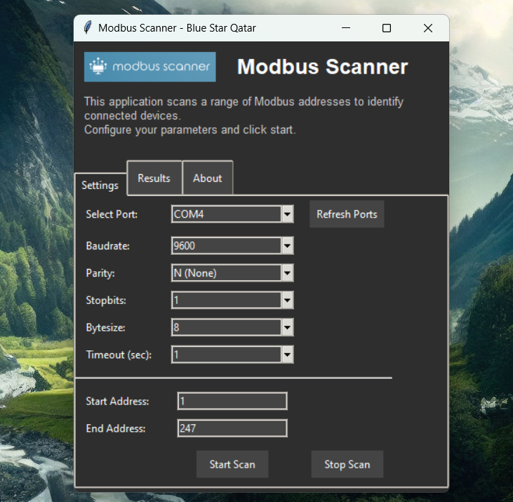

# Modbus Scanner Application

### Overview

The **Modbus Scanner Application** is a simple tool designed to scan a range of Modbus addresses and list out connected Modbus devices. This application is built using Python, Tkinter for the graphical user interface (GUI), and PyModbus for the underlying Modbus communication.

It allows users to configure communication parameters such as serial port, baud rate, parity, stop bits, and more. Users can view the progress of the scan and stop it anytime. The results can be viewed in the GUI or saved for later reference.

### Background

I couldn't find a simple portable tool to check whether all devices in the loop are communicating or not, so I created this application.

**Built with GPT-4o** This application was generated with the help of GPT-4o. 95% of this application is written by GPT-4o and the whole application was completed in a matter of minutes. This is basically a wrapper for pymodbus package.

Tested in a live environment with 3 slave devices.



---

### Features

- **Modbus Address Scanning**: Scans a range of Modbus addresses to detect connected devices.
- **User-friendly Interface**: Configurable parameters like baud rate, parity, port, stop bits, and timeout via an intuitive interface.
- **Real-time Results**: Results are displayed in real-time with a progress bar to show the status of the scan.
- **Dark Theme**: A modern dark theme for better visual experience.
- **Stop Scan**: Option to stop the scan at any point.
- **Save Results**: Results are saved into a text file on completion.

---

### How to Use

#### 1. Configure Settings

On the **Settings** tab, configure the following parameters:

- **Port**: The serial port used for communication (e.g., `/dev/ttyUSB0` or `COM3`).
- **Baud Rate**: The baud rate for the connection (e.g., `9600`).
- **Parity**: The parity mode (None, Even, Odd).
- **Stop Bits**: Choose between `1` or `2` stop bits.
- **Byte Size**: The number of data bits (5, 6, 7, or 8).
- **Timeout**: Timeout in seconds for device responses.
- **Start Address**: The starting Modbus address for the scan.
- **End Address**: The ending Modbus address for the scan.

#### 2. Start the Scan

After configuring the settings, click the **Start Scan** button. The application will begin scanning the specified range of Modbus addresses. Results will be displayed in the **Results** tab.

#### 3. Stop the Scan

At any time during the scan, you can click the **Stop Scan** button in the **Results** tab to stop the scanning process.

---

### Installation

#### Prerequisites

- **Python 3.x**: Make sure you have Python 3.x installed on your system.
- **Pip**: Ensure pip is installed to handle Python packages.

#### Clone the Repository

Clone this repository using Git:

```bash
git clone https://github.com/BlueStar-Qatar/ModbusScanner.git
cd modbus-scanner
```

#### Install Dependencies

Install the necessary Python libraries using the `requirements.txt` file:

```bash
pip install -r requirements.txt
```

The main dependencies are:

- **PyModbus**: For Modbus communication.
- **Tkinter**: For the graphical user interface.
- **Pillow**: For handling images and resizing the logo.

#### Run the Application

Once the dependencies are installed, run the application with:

```bash
python modbus_scanner_app.py
```

---

### Packaging the Application

You can package the application into a standalone executable using **PyInstaller**. This will bundle the Python interpreter, dependencies, and resources like the embedded logo.

#### Install PyInstaller

Install PyInstaller using pip:

```bash
pip install pyinstaller
```

#### Package the Application

To create a standalone executable (for example, on Windows), run the following command:

```bash
pyinstaller --onefile --windowed modbus_scanner_app.py
```

This will create a single executable file in the `dist/` directory that can be distributed without requiring Python to be installed.

---

### Project Structure

```plaintext
modbus_scanner/
│
├── modbus_scanner_app.py      # Main application
├── modbus_ui.py               # UI components
├── modbus_scanner.py          # Modbus scanning logic
├── modbus_helpers.py          # Helper functions
├── requirements.txt           # Python dependencies
└── README.md                  # This README file
```

---

### Credits

- **Python**: The core programming language used.
- **Tkinter**: The GUI framework for building the interface.
- **PyModbus**: Library for Modbus protocol support.
- **Pillow**: Image processing library used to embed the logo.

---

### License

This project is licensed under the MIT License - see the [LICENSE](LICENSE) file for details.

---

### Contact

If you have any questions or need further assistance, feel free to contact:

- Shan M
- shan [at] bluestarqatar [dot] com
