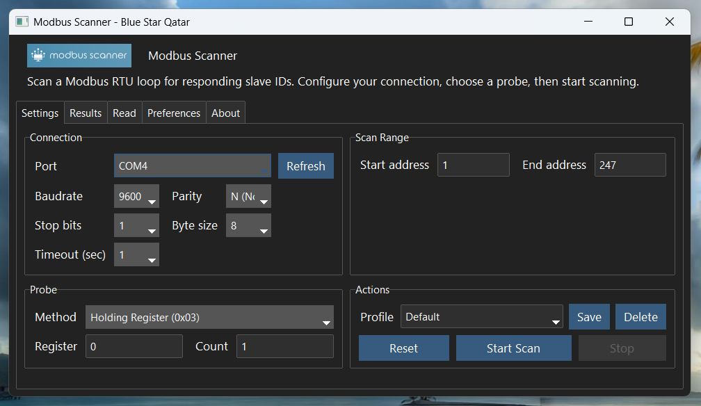

# Modbus Scanner Application

### Overview

The **Modbus Scanner Application** is a lightweight desktop field tool for **Modbus RTU** (serial/RS-485). It scans a range of slave IDs to find responding devices and can also read live data (coils, discrete inputs, and registers) from a selected slave.

It is built with Python + Tkinter/ttk (styled with `ttkbootstrap`) and uses `pymodbus` for Modbus communication. Results can be reviewed in-app and exported for reporting.

### Background

I couldn't find a simple portable tool to check whether all devices in the loop are communicating or not, so I created this application.

**Built with GPT-4o** This application was generated with the help of GPT-4o as a wrapper around `pymodbus`, then refactored and expanded with a modern UI, exports, profiles, and live read/polling using GPT 5.2.

Tested in a live environment with 3 slave devices.



---

### Features

- **Modbus Address Scanning**: Scans a range of Modbus slave IDs to detect connected devices.
- **Configurable Probe**: Choose probe method (0x03/0x04), starting register and count to reduce false negatives.
- **Modern Results View**: Table view with per-slave status + response time; double-click any row for full details.
- **Progress + Status Bar**: Real-time scan progress, current slave ID, and summary counters.
- **Export + Auto-save**: Save as TXT/CSV/JSON and auto-save a timestamped TXT to a user-writable location.
- **Read Live Data**: Read coils/discrete inputs/holding registers/input registers (0x01/0x02/0x03/0x04).
- **Polling / Refresh Reads**: Start polling with a configurable interval for live monitoring.
- **Data Decode Options**: Common data types + byte/word order controls; coils/inputs can display as `True/False` or `0/1`.
- **Themes**: Light/Dark toggle with blue accents (in the **Preferences** tab).
- **Profiles**: Save named profiles and automatically restore last-used settings (stored in `~/.modbus_scanner/preferences.json`).
- **Stop Anytime**: Stop scan/read/polling quickly and safely.

---

### How to Use

#### 1. Configure Settings

On the **Settings** tab, configure the following:

- **Connection**: Port, Baud Rate, Parity, Stop Bits, Byte Size, Timeout.
- **Scan Range**: Start Address / End Address (used as the slave ID range to scan, typically `1` to `247`).
- **Probe**: Probe Method (Holding Registers `0x03` or Input Registers `0x04`) and the probe Register + Count.
- **Profile**: Select a saved profile, or type a new profile name and click **Save** (or **Delete**).

#### 2. Start the Scan

After configuring the settings, click **Start Scan**. The app switches to the **Results** tab and begins scanning. You’ll see a table of slave IDs with:

- Status (`Responded`, `Exception`, `No response`, `Error`)
- Response time (ms)
- Details (double-click a row to view full details)

#### 3. Stop the Scan

At any time during the scan, click **Stop Scan** on the **Results** tab (or press `Esc`) to stop the scan.

#### 4. Read Data from a Slave

Open the **Read** tab and configure:

- **Slave ID**, **Start address**, and **Count**
- **Function**: Coils (`0x01`), Discrete Inputs (`0x02`), Holding Registers (`0x03`), Input Registers (`0x04`)
- **Decode options** (register reads): data type + byte/word order
- **Bit format** (coil/input reads): `True/False` or `0/1`

Click **Read Once** (or press `F5` / `Ctrl+R`).

For live monitoring, use **Start Poll** with a poll interval to refresh values continuously. Click **Stop** (or press `Esc`) to end polling/reads.

#### 5. Preferences

Open the **Preferences** tab to toggle **Dark mode** and view the available keyboard shortcuts.

---

### Installation

#### Prerequisites

- **Python 3.9+**: Required for modern typing used by the app.
- **Pip**: Ensure pip is installed to handle Python packages.
  - On some Linux distributions you may need `python3-tk` installed for Tkinter.

#### Clone the Repository

Clone this repository using Git:

```bash
git clone https://github.com/BlueStar-Qatar/ModbusScanner.git
cd ModbusScanner
```

#### Install Dependencies

Install the necessary Python libraries using the `requirements.txt` file:

```bash
pip install -r requirements.txt
```

The main dependencies are:

- **PyModbus**: For Modbus communication.
- **PySerial**: Serial transport required by PyModbus RTU.
- **Tkinter**: For the graphical user interface.
- **Pillow**: For handling images and resizing the logo.
- **ttkbootstrap**: For modern light UI theming (Bootstrap-inspired ttk styles).

#### Run the Application

Once the dependencies are installed, run the application with:

```bash
python modbus_scanner_app.py
```

---

### Packaging the Application

You can package the application into a standalone executable using **PyInstaller**. This will bundle the Python interpreter, dependencies, and resources like the embedded logo.

#### Build a Single-File Portable App

Builds must be done on the target OS (Windows builds Windows `.exe`, etc.).

```bash
pip install -r requirements-dev.txt
python scripts/build_portable.py
```

- Output: `dist/ModbusScanner.exe` (Windows) or `dist/ModbusScanner` (Linux/macOS)
- Optional: `release/ModbusScanner-<version>-portable.zip`

If you prefer to run PyInstaller directly:

```bash
python -m PyInstaller --noconfirm --clean --onefile --windowed --name ModbusScanner --additional-hooks-dir packaging/hooks modbus_scanner_app.py
```

---

### Project Structure

```plaintext
.
├── modbus_scanner_app.py      # Main application (Tkinter/ttk UI)
├── modbus_ui.py               # UI layout builders (tabs/widgets)
├── modbus_scanner.py          # Scan + read worker logic
├── modbus_decode.py           # Register decoding helpers
├── modbus_prefs.py            # Preferences + profiles persistence
├── modbus_helpers.py          # File/export helpers + tab switching
├── modbus_config.py           # Defaults
├── modbus_version.py          # App metadata (version, names)
├── packaging/                 # PyInstaller hooks + generated assets
├── scripts/build_portable.py  # One-file portable build script (PyInstaller)
├── tests/                     # Unit tests
├── requirements.txt           # Runtime dependencies
├── requirements-dev.txt       # Dev/build dependencies
├── screenshot.png             # Screenshot (may be outdated)
└── README.md                  # This README file
```

---

### Credits

- **Python**: The core programming language used.
- **Tkinter**: The GUI framework for building the interface.
- **PyModbus**: Library for Modbus protocol support.
- **PySerial**: Serial transport used by Modbus RTU.
- **Pillow**: Image processing library used to embed the logo.
- **ttkbootstrap**: Modern theming library for Tkinter/ttk.
- **PyInstaller**: Packaging tool for building a one-file portable executable.

---

### License

This project is licensed under the MIT License - see the [LICENSE](LICENSE) file for details.

---

### Contact

If you have any questions or need further assistance, feel free to contact:

- Shan M
- shan [at] bluestarqatar [dot] com
